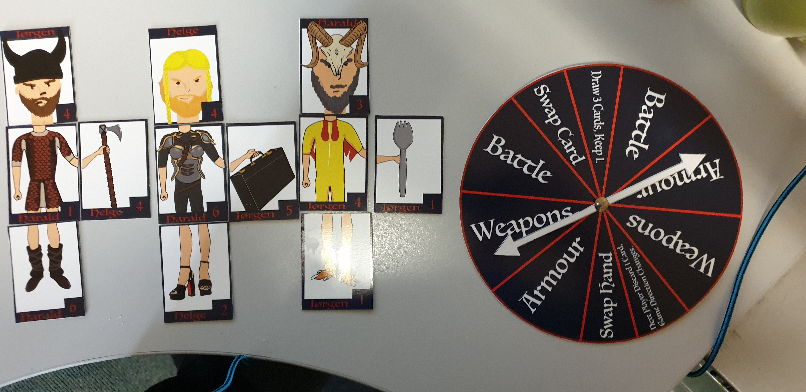
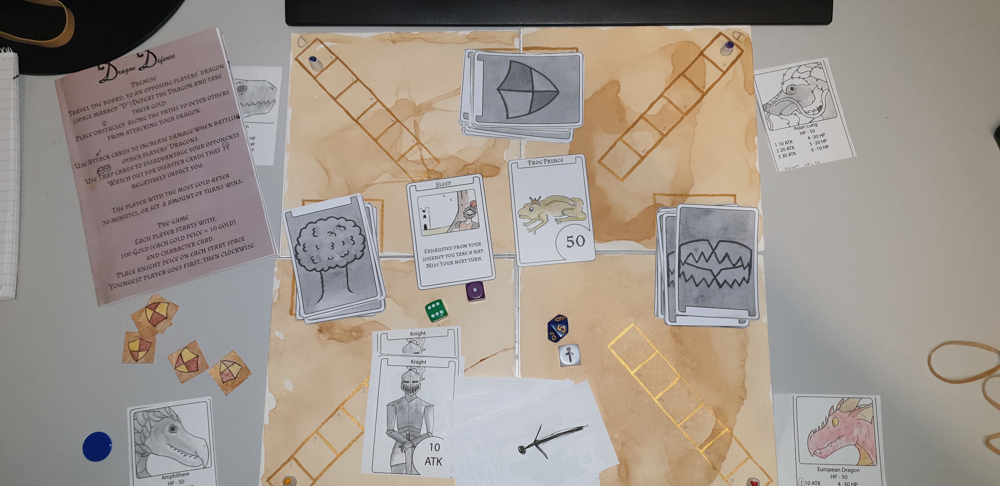
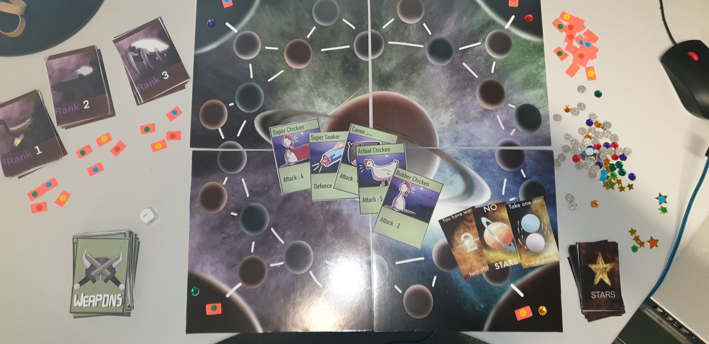
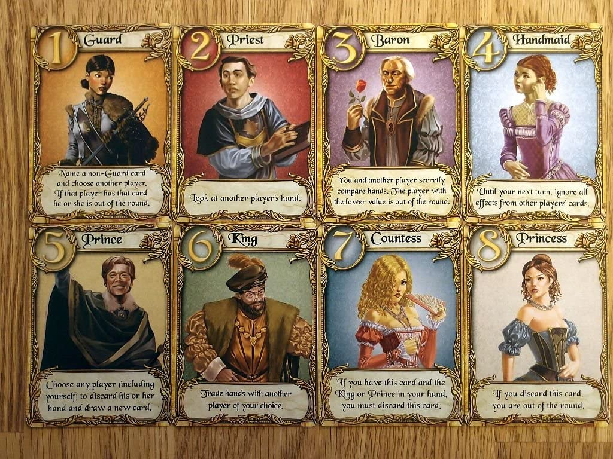

# Cross Discipline Collaboration

Game development is seldom a solitary pursuit. Most games are developed by a team of people each with their own specialist knowledge and experience. Learning to work in teams with people from different disciplines is essential for every Game Development student.  

## Games Fundamentals & Illustration

In 2019-20 I arranged with Charlene Clempson (Illustration lecturer from the School of Art & Design) for my first year Games Development students and her first year Illustration students to work together to collaboratively create boardgames in small teams. The students were brought together early in the semester for a startup session consisting of playing boardgames as an ice-breaking, getting to know each other activity. At the end of the session the students self organised in to groups (with the stipulation it must contain students from both subjects).  

  
*Student Game Jorgen's Secret*  

Across the rest of the semester both modules ran two lecture/tutorial sessions for students from both modules to support the development of their games and also for a chance to "see how the other side works". Joint lab/workshop sessions were held where the students developed, play tested and finally demonstrated their games.  

  
*Student Game - Dragon Defence*  

Overall this was a successful collaboration. Each group successfully created a boardgame. Generally the students worked well together, both within and across the disciplines. There were some communication issues, one team struggled to work across the disciplines due to poor engagement and effort, they had to be pushed constantly. Another group had issues where a one student behaved as if he was in charge of the group, gave orders and made unilateral decisions. Fortunately this was identified early enough that it could be addressed with a quiet, private discussion with the student.  

  
*Student Game - Space Conquerors* 

The collaboration was successful enough that we discussed how to continue it. We discussed a number of issues. There were issues with engagement and students turning up to the joint sessions. We considered if the nature of the collaborative session timing (not every week) was an issue and decided that the collaboration might work better if it was more like a game-jam and condensed in to a single, longer session. We settled on, for the next year, bringing the students together for a two day session mid-way through the semester. This would allow the students to focus on the project and only the project for a couple of days and see it through from start to finish.  

We also decided to narrow the scope of the collaboration. We had allowed the students to make any boardgame they wanted, this worked well for groups that played boardgames regularly but some struggled with the lack of direction. Additionally some groups over-estimated what could be achieved and were disappointed by their limited success (as they saw it). One group produced a very simple game that reflected poorly on thier use of the time. We considered a number of options and reflected on the interests of the students and the needs of modules. We settled on the idea of asking the students to create an extension to an existing boardgame. I identified the card game [Love Letter](https://www.zmangames.com/en/games/love-letter/).  

**Love Letter** is a card game that is simple to learn but has surprising depth of replayability. It features a small number of cards (only sixteen), with each card featuring a character and an ability. Gameplay consists of playing cards and trying to end up with the highest value card at the end of the game. Love Letter has been very successful and many versions of it have been releases with slight variations and differing themes. Instead of making a new game the students would be asked to come up with two new cards to add to the game, ensure they were tested for balance and fun and then produce a version of the game with a new theme. This would cover the requirements for the Games Fundamentals module (iterative game development, testing, rules analysis) and meet the needs for the Illustration students and their preference for illustrating characters.  

  
*Love Letter* 

Unfortunately the next year face to face teaching was cancelled because of the Covid pandemic. A collaborative project with first year students from different disciplines, who hadn't event met the other students from thier own discipline, was deemed unfeasable and the collaboration was put on hold. During the preparation for the subsequent academic year the collaboration was left on hold as we didn't know if we would be returning to face to face teaching.  We are working to bring it back this year.  

## Collaboration with Games Design Programme

The Games Design programme (in the School of Art & Design) focuses on the art and design side of video games. Where Games Development are focused on the programming of the code that underpins video games the Games Design programme is more focused on the design of the game and its components - levels, characters, interfaces, etc. The two programmes complement each other well, each mirroring two important skillsets in commercial games development.  

Games Design has a second year, second semester game project module. In this module students work together in small groups to create a game, studying the stages and processes involved. It is a perfect opportunity for our students to work together. In revalidating the Games Development Programme ([discussed further here](GamesDevRevalidation.md)) I ensured we have a similar second year, second semester module that will tie in with the Games Design module. Our students will work together to create a game, giving both sets of students a chance to work with a related but distinct discipline. The assessment is focused on what the students learn from engaging in the process in the form of a reflective journal and report based on their experiences.  

It is hoped we can build on this collaboration and expand it to include other disciplines. We would like to have collobarations that include not only our disciplines but also music and creative writing students. On a larger scale business students might also be interested.  

## YSJ Game Jam

A game jam is *A game jam is an accelerated opportunistic game creation event where a game is created in a relatively short timeframe exploring given design constraint(s) and end results are shared publically.* (Kultima 2015).  

We would like to host a game jam for our students. Plans to do this were interrupted by the Covid pandemic and are being resumed.  

## References

* Kultima, A. (2015). Defining Game Jam. Proceedings of the 10th International Conference on the Foundations of Digital Games (FDG 2015), June 22-25, 2015, Pacific Grove, CA, USA.